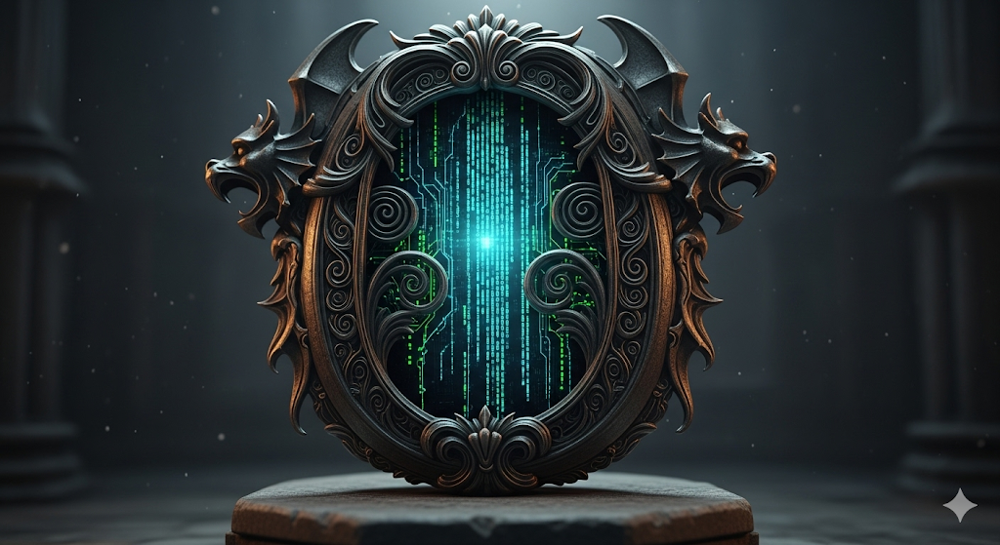

# ⚔️ Element AK-47 ⚔️  
**The Arcane Serverless Oracle**  

*A gothic digital artifact fusing AI, Cloudflare, and mythic storytelling*  

  

---

## 🌑 The Lore: Invocation of the Relic
In the mortal world it is a **demo**, yet in the arcane archives it is a **relic**.  
**Element AK-47** binds **Cloudflare Pages, Cloudflare Functions, and the Gemini API** into a cathedral of code where every keystroke is a ritual.  

.png)  

---

## 🔮 Prophecy: What This Relic Does
- **Serverless Sorcery** — Cloudflare Pages + Functions power the vessel.  
- **Oracle Integration** — Gemini API fuels generative prophecy.  
- **Failsafe Rituals** — Retries, mocks, and graceful fallbacks keep the forge alive.  
- **Dual Ambience** — Gothic dark-mode or classroom light-mode.  
- **Runic Animations** — Text glows and flows as if whispered by forgotten gods.  

.png)  

---

## 📈 Market Divination
.png)  

This relic doubles as a **demo + engagement engine**. Imagine:  
- Hackathons powered by myth.  
- DevRel campaigns with unforgettable presence.  
- Teaching serverless through gothic immersion.  

---

## ⚔️ Deployment Rite
```bash
# Install the Cloudflare Workers CLI
npm i -g wrangler

# Awaken the Oracle locally
wrangler pages dev public --compatibility-date=2024-09-01
```

Environment Secrets:  
- `GEMINI_API_KEY` — the sacred key  
- `GEMINI_MODEL` — default: `gemini-2.5-flash-preview-05-20`  

.png)  

---

## 🪙 Valuation Angles
| Category                | Potential |
|--------------------------|-----------|
| DevRel Artifact          | $5k–$20k |
| Hackathon Licensing      | $10k–$40k/year |
| Educational Productization | $99–$199 per student |
| Digital Collectible Relic | $2k–$10k |

  

---

## 🚀 Go-To-Market Ritual
1. **Branding** — Position as *The Arcane Serverless Oracle*.  
2. **Channels** — Dev conferences, Product Hunt, viral lore drops.  
3. **Expansion** — More API templates, alternate mythic skins.  

  

---

## 🧙 About the Author — *Cosmic Weaver*  
.png)  

In the daylight he is **Andrias Kund** (born beneath the spring sun, 1993).  
In the shadowed cathedral of code he is the **Cosmic Weaver** — myth-smith, conjurer, entrepreneur.  

- ⚔️ Founder of **KUNDTEC OÜ** (2017–)  
- 🜏 Steward of **Margid OÜ**, **Biochemtec OÜ**, **INFILTRASEC OÜ**  
- 💀 From modest revenues to projected net worth beyond €700k  
- ✨ Creed: *“We do not build products, we forge artifacts — relics to outlive their creators.”*  

---

## Closing Incantation
*"Element AK-47 is not just a demo — it is a gothic oracle that fuses AI, Cloudflare, and myth into a digital relic of the future."*  

⛧ Codex Arcana — *Element AK-47* ⛧  
